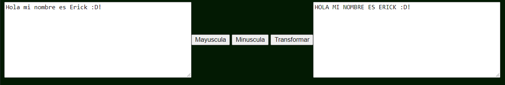
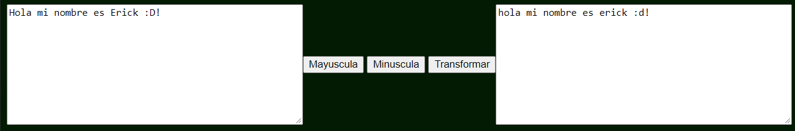
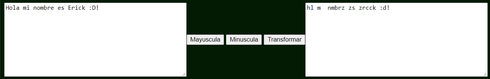

# Ejercicio extra arrays/palabras - web

- Diseñar una pagina web que permita ingresar texto con los siguientes requisitos:
    1. Debe contar con 3 opciones
        - Transformar texto a ``MAYUSCULA``
        - Transformar texto a ``minuscula``
        - Transformar el texto original dependiendo de las vocales detectadas:
            1. Con `a` se `elimina` el caracter 
            1. Con `e` se reemplaza el caracter con `z`
            1. Con `i` se reemplaza el caracter con el caracter de la `siguiente posicion`
            1. Con `o` se `elimina` el caracter 
            1. Con `u` se reemplaza el caracter con el caracter de la `anterior posicion`

    1. Una salida visual para el texto transformado

- Ejemplos:
    - A mayuscula
    

    - A minuscula
    

    - Transformacion usando vocales
    